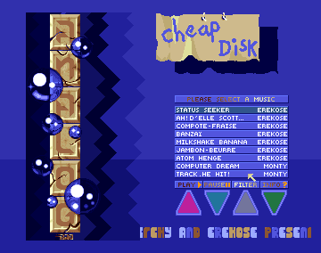

# Amiga
Amiga Demos in 68000 ASM from Arnaud Guyon

## Cheap Disk

### Description

This is a music disk made for Analog. Works fine on A1200 and is supposed to work also on A500 but there is a bitplan issue on A500.

### Launch

- In folder "CheapDisk" launch Asmone
- Choose memory allocation (for example Chip 1000K). It requires a lot as there are several musics.
- Load the code: "r", then "MusDisk2.s"
- Assemble the code: "a" (no option)
- Run the example: "jr"
- Left mouse to change the musics
- ESC to quit

